# Production Dashboard — User Guide

This guide explains how to use the Costello Windows production dashboard —
both the office screen and the glass floor tablet. It is written for anyone
who signs in and uses the dashboard day to day; it does not cover setting the
system up or fixing it when something breaks (see *Support and Maintenance*
for that).

---

## 1. What the dashboard is

The dashboard is two web pages that show the same production workbook from
two different points of view:

- **The Master dashboard** (`index.html`) — used in the office. It shows
  every job, every section, dates, checkpoints, phases, alerts and exports.
- **The Glass station** (`glass.html`) — used on a shared tablet on the glass
  floor. It shows only job number, customer name, one number of glasses per
  job, and the three glass stages: Cutting, Hotmelting, Glazing.

The Excel workbook on SharePoint stays the single source of truth for every
job. The dashboard reads it and writes back to it only in the ways described
in this guide — a colour on a checkpoint cell, or moving a job's whole row
between sections. It never adds a row, deletes a row, or changes a date,
comment, quantity, customer name or any other cell on its own. Everything
else the dashboard needs — exact checkpoint counts, phases, alerts, and the
floor's own progress — is kept in a handful of extra sheets and lists that sit
alongside the workbook, never inside the jobs themselves.

---

## 2. Signing in

### 2.1 The office

1. Open the Master dashboard in a browser.
2. Click **Sign in with Microsoft** and use your own Costello account.
3. The first time a new device or browser signs in, Microsoft may show one
   permission prompt asking the account to allow the dashboard to read and
   write the workbook. Accept it — this is the normal, one-off consent every
   Microsoft sign-in shows to a new app.
4. You will see exactly the jobs your account could already open directly in
   Excel — the dashboard grants nothing extra.

### 2.2 The tablet

The glass floor tablet is signed in once, by whoever sets it up, with a
single shared station account — not a personal account. Ordinary use of the
tablet never asks anyone to sign in again; it only asks a person to pick
their own name (see §4.1).

"Stay signed in" on either page simply means the browser keeps the sign-in
token so nobody has to re-enter a password every time the page is opened. On
the tablet this matters more than on the office screen, since the tablet may
sit open for weeks at a time.

---

## 3. The Master dashboard, screen by screen

### 3.1 Header and status

The header shows the dashboard's live state at a glance:

| Element | What it means |
|---|---|
| Live dot | On while the dashboard is actively polling for changes |
| Status text | "starting…", "read failed", or similar — the current state of the last read |
| Build number | The footer shows `build YYYYMMDD-HHMM` — the exact version currently loaded |
| Reload banner | Appears when the server has a newer build than the one open; click **Reload** to pick it up |

The dashboard checks for a new build every couple of minutes. If the banner
appears, there is no rush — finish what you are doing, then reload.

### 3.2 Summary tiles

A row of tiles above the job list gives quick counts — total jobs, windows,
doors — for the current view.

### 3.3 The toolbar

| Control | What it does |
|---|---|
| Select all shown (n) | Appears at the left of the toolbar whenever a tile, a category or a search is narrowing the list: one tick picks every job on screen, one untick clears them again. It is not there when the whole sheet is showing, because then "all shown" and "all" are the same thing |
| Search box | Filters the job list by job number, customer, county, eircode or any comment |
| View | Switches between the flat list, the sheet's own section order, or a saved custom grouping |
| Show | Switches the main panel between **All jobs**, the **Glass station** board (§3.10) and the **John print sheet** (§3.9) |
| Floor log | Opens the read-only Floor log window (§3.11) |
| Categories… | Manage custom groupings used by the View dropdown |
| Sort | Reorders the job list |

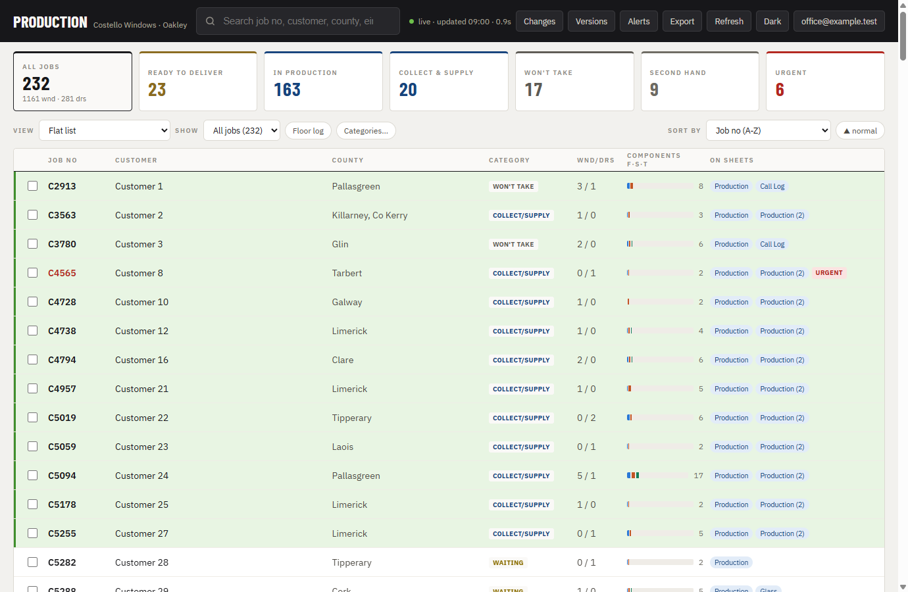
*The Master dashboard's job list, with the toolbar above it.*

### 3.4 The job list

Each row shows the job number, customer, county, category, window/door
counts, product component counts (Frame · Sash · Transom) and a chip for
every other workbook sheet the job appears on. Row colours and chips mirror
the sheet's own colouring where relevant. Ticking the box on the left of one
or more rows arms the selection wheel (§3.5).

**The colour chip after a job number.** The Production sheet says four things
with the colour of a job row's *text*, and the dashboard reads them back and
writes them out in words, so nobody has to tell red from green to know what a
row means:

| Row text on the sheet | Chip |
|---|---|
| red | **Urgent** |
| green | **Booked** — an exact delivery date is agreed |
| pink / magenta | **Trade order** |
| blue | **On hold** |

A red row counts as urgent in the dashboard just as the word "urgent" in the
Comment column always has. Black or grey text means nothing in particular and
gets no chip. The same chip appears at the top of the job's drawer.

**Selecting a whole section.** In a grouped view (View ▸ sheet order, or any
saved grouping) each section header carries a **Select all n** tick box: it
picks every job that section is currently showing, including after you have
typed in the section's own search box. Ticking part of a section by hand
leaves the box in its half-ticked state rather than claiming either way. In
the flat list the same job is done by **Select all shown (n)** in the toolbar
(§3.3).

### 3.5 The selection wheel

Ticking at least one job shows a floating button; tapping it fans out a
full-circle menu with four options:

- **Alert to…** — subscribe an address to email alerts for the ticked jobs.
- **Export** — open the Export window pre-filtered to the ticked jobs.
- **Move to…** — move the ticked jobs to a different section.
- **Untick all** — clear the selection.

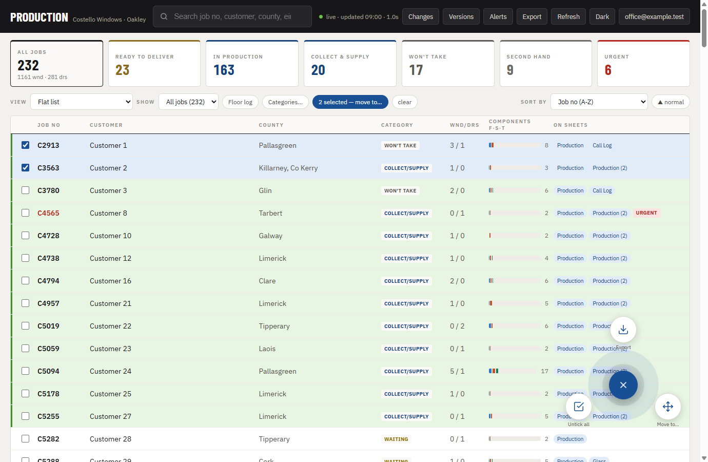
*The radial selection menu, opened after ticking one or more jobs.*

A section move is a real structural change in Excel: the dashboard finds each
job's row, copies its values, formats, fills and borders to a new position
in the target section, and deletes the original row. It is the only feature
in the dashboard that adds or removes a row.

### 3.6 The job drawer

Clicking anywhere on a job row opens its drawer, with several parts:

**Phase pipeline.** A seven-step line — In office → Sent to floor → Cutting →
In fabrication → In glazing → Quality check → Fitted / delivered — showing
how far the job has got. Most of the time this is worked out automatically
from what is already on the sheet; clicking a step by hand overrides it, and
the sheet's own evidence always wins if it later shows the job further along.

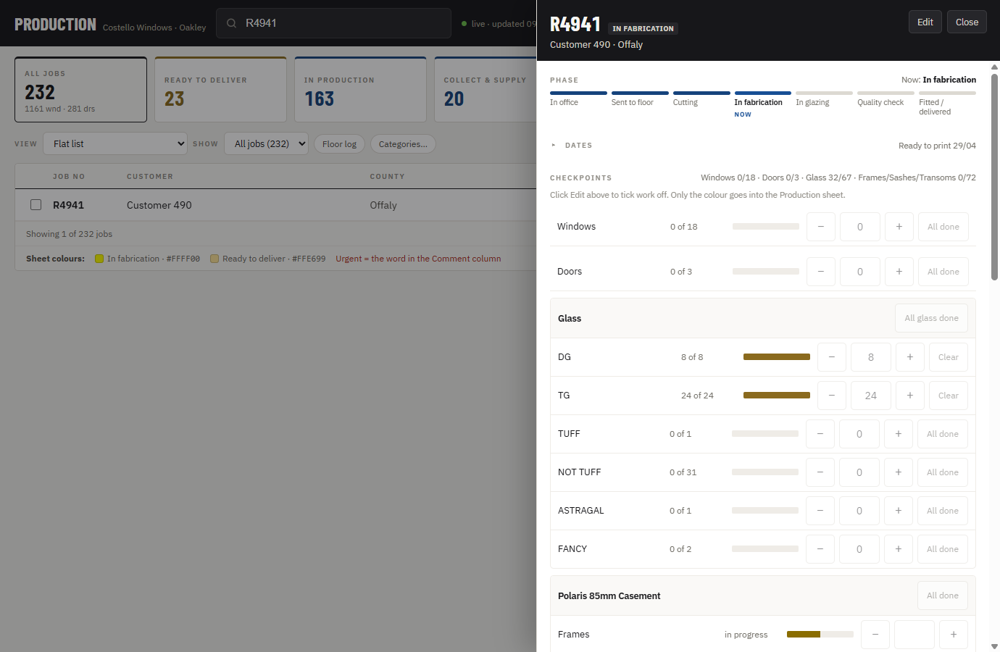
*The top of a job's drawer: the phase pipeline and the checkpoints below it.*

**Dates.** The job's key dates, read-only here.

**Checkpoints.** Tick boxes for windows, doors, each glass type and each
product's frame/sash/transom counts. Ticking a checkpoint writes **only a
colour** to that item's own cell in the `Production` sheet (white for
nothing done, yellow for part done, gold for done) — the exact count behind
that colour is kept in a separate dashboard sheet, not in the cell itself.

**Details.** Other job facts read from the sheet.

**Glass units.** The job's DG/TG/TUFF and other glass quantities, as ticked
in Checkpoints above.

**Glass station section.** For a job with glass, a "Glass station" panel
shows the same three stages the floor tablet uses — Cutting, Hotmelting,
Glazing — each with who last moved it and when, a short timeline of the most
recent taps on this job (capped at twelve lines), and a "Full log" link into
the Floor log window (§3.11).

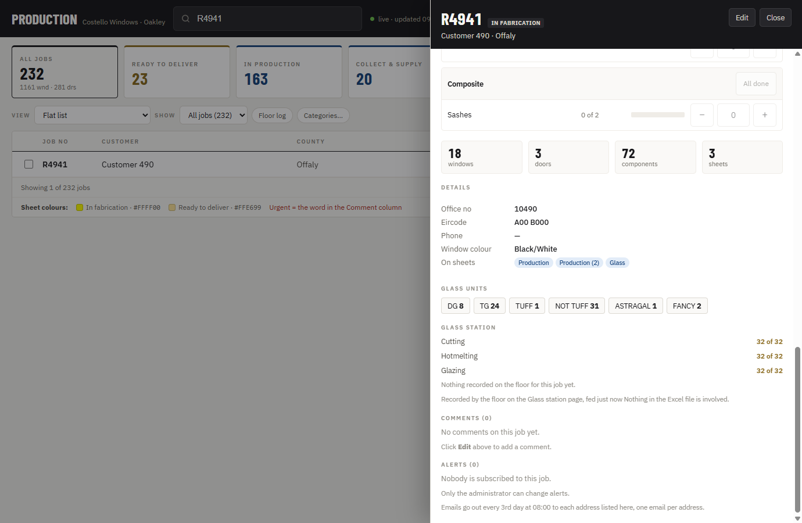
*The Glass station section of the drawer, showing who moved each counter, when, and the recent timeline.*

**Comments.** The job's comment text from the sheet.

**Alerts.** Addresses currently subscribed to email alerts for this job
(admin only — see §3.8).

### 3.7 Mark ready and undo

**Mark ready** fills the job's status cell gold and moves its row to "Ready
to fit" (or "Collect & supply only" for C/S-prefixed jobs). **Undo** clears
that fill and moves the row to the bottom of "In production". Neither action
touches any date.

### 3.8 Changes, Versions, Alerts, Export

- **Changes** — a running log of every write the dashboard has made.
- **Versions** — SharePoint's own version history of the workbook. You can
  see the difference between two versions and restore an older one; a
  restore itself becomes a new, rollable version.
- **Alerts** (admin only) — subscribe email addresses to jobs. Every third
  day at 08:00, each subscriber gets one email listing their jobs still in
  production, with comments. The admin address is read from the workbook's
  own configuration, not typed into the dashboard.

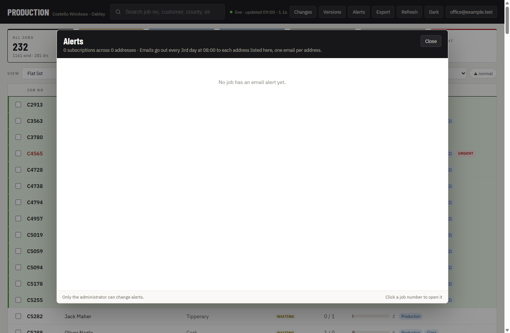
*The Alerts window, listing current subscriptions.*

- **Export** — download the current jobs (or just the ticked ones) as an
  Excel workbook or a PDF. The window opens on a **Template** choice:

  - **Default** — filters, a field picker and a card or table layout, exactly
    as before. **No phone number and no eircode** are ever included in it, in
    any format, under any filter. The field picker also offers **Flag**, the
    row colour code from §3.4, which comes out as a column with the word in
    the sheet's own colour.
  - **John print sheet** — the `Production (2)` sheet as it prints for John,
    and nothing to configure: job no, ready to print, customer, **phone no**,
    area, windows, doors and the notes from Brendan's office, in that sheet's
    own order, with its section dividers, its row fills and its row text
    colours. Pick the scope (the ticked jobs, or everything the view you are
    on is showing) and Excel or PDF, then **Continue to notes**. A job you
    have picked that is not on `Production (2)` is still printed — from the
    main Production sheet, in grey, marked "not on John's sheet".

  Every export is recorded once in the Changes log — nothing else about what
  was exported is stored anywhere. A John print's log line says in words that
  the file carries phone numbers, because it is the only one that does.

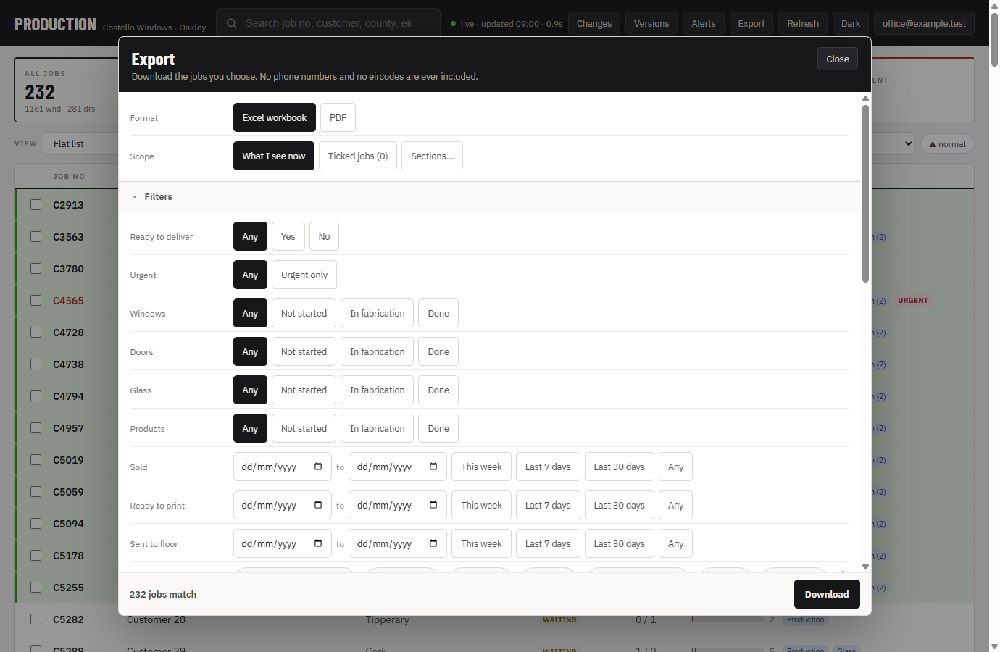
*The Export window: format, filters and the field picker.*

**Print notes (John print sheet only).** "Continue to notes" opens one row per
job in the print: the job number, the customer, its colour chip, that job's
note from `Production (2)` in grey (which you cannot change from here, with the
main sheet's comment underneath it when the two differ) and a box for one extra
note of your own, already filled in with whatever was typed last time.
**Print** saves the notes you changed and then downloads the file. The notes
are kept by the dashboard in SharePoint — **nothing here is ever written into
the Excel file**, `Production (2)` included — and they are printed at the end
of the Notes column, after the sheet's own. If a note cannot be saved, its row
says "not saved" and the file is still made with what you typed. Escape or
**Cancel** backs out without printing; clicking the greyed-out background asks
first if you have typed anything. Each job's note also shows, read-only, under
Comments in that job's drawer.

### 3.9 Show ▸ John print sheet

Switching the **Show** dropdown to **John print sheet** replaces the job list
with `Production (2)` — the separate sheet the office keeps for the paper John
works from. It is shown exactly as that sheet has it: its own rows, its own
order, its own sections, and every row in its own fill and text colour, with
the colour's word beside it. The columns are the eight that get printed: job
no, ready to print, customer, phone no, area, Wnd, Drs, and the notes from
Brendan's office.

The search box at the top narrows it. Each row has a tick box and each section
a **Select all n**, exactly as the grouped job list does, and what you tick
feeds the same selection wheel. Opening **Export** from here starts on the John
print sheet template.

This view is read-only: there is no drawer, nothing can be dragged, and nothing
in it writes to the workbook. It shows whatever the last refresh downloaded.

### 3.10 Show ▸ Glass station board

Switching the **Show** dropdown to **Glass station** replaces the job list
with a read-only board: one card per active job, in the office's own order,
with the job number, customer, the total glass count, and the three counters
(Cutting, Hotmelting, Glazing) each showing who last moved it and when. A
job whose three counters have all reached the total turns gold and drops to
the bottom of the board. The board refreshes about every ten seconds while
it is on screen. Nothing on it can be clicked to change anything.

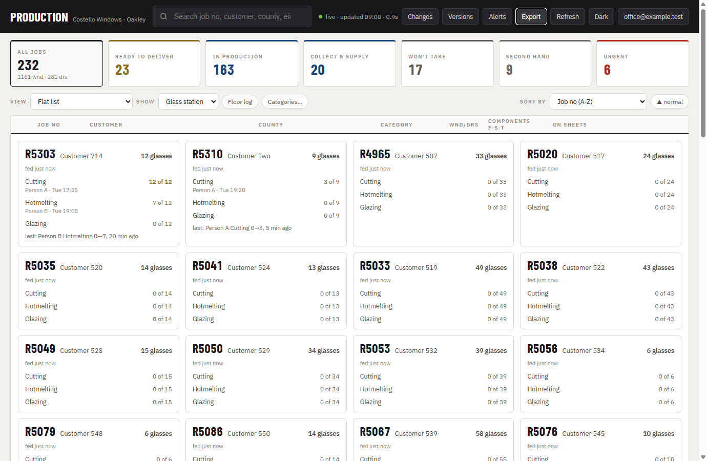
*The office's read-only Glass station board.*

### 3.11 The Floor log window

Opened from the **Floor log** button or a drawer's "Full log" link, this
lists every recorded floor tap, newest first, with filters for person,
stage, job number and day, and a running count of lines and units for
whatever is currently filtered. It pages 200 rows at a time. Clicking a job
number opens that job's drawer, if the job is still on the sheet. It is
read-only — nothing here can be edited or deleted from the dashboard.

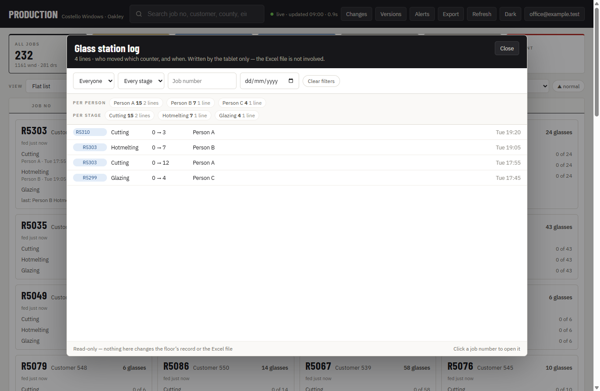
*The Floor log window, filtered by person and stage.*

---

## 4. The Glass station tablet, screen by screen

### 4.1 Who are you?

On opening (or after a lock, or Switch person), the tablet shows a picker of
active people for the glass station, read from a list the admin maintains.
Tap your name.

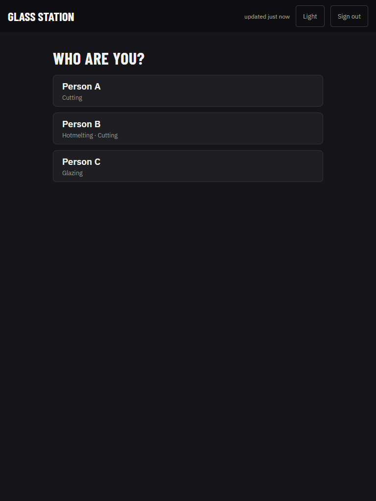
*The tablet's picker, listing active people for the glass station.*

If your name has a PIN set, a PIN pad appears next; enter it to continue. A
wrong PIN simply shakes and asks you to try again — there is no lockout.

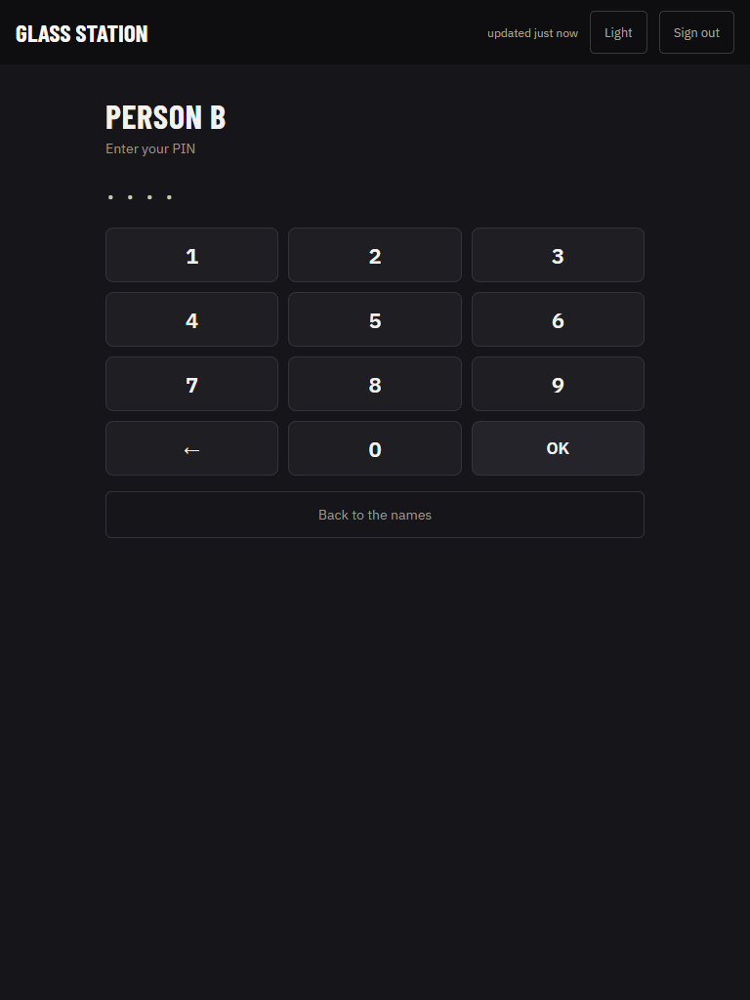
*The PIN pad, shown only for people who have a PIN set.*

### 4.2 The card

Every job with glass appears as one card: job number, customer, and one
total number of glasses, followed by three rows — Cutting, Hotmelting,
Glazing — each with a **−**, a count, a **+**, and an **All** button (which
becomes **None** once that stage is already at the total). Only the stage
rows you personally hold are bright and tappable; the others show their
numbers but are greyed out and cannot be tapped. There is nothing to expand
and nothing to scroll inside a card.

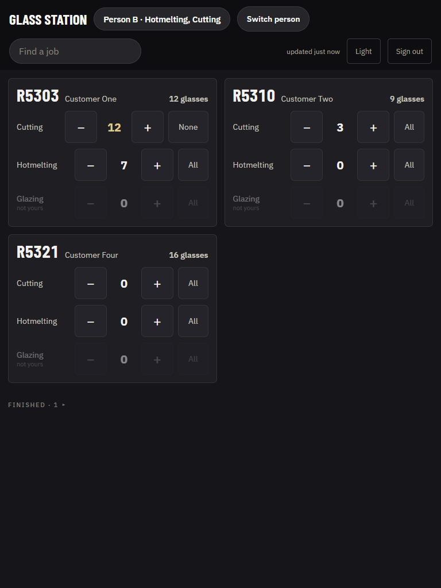
*The tablet board: one card per job, dark theme, three stages on the card itself.*

### 4.3 Gold and the Finished group

Once a job's three counters all reach the total, its card turns gold and
moves into a collapsed "Finished · n" group at the bottom of the board — tap
the heading to show it.

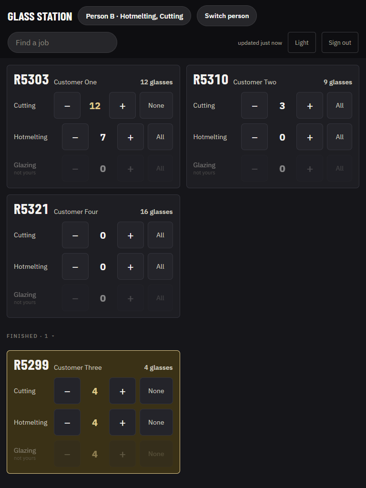
*A finished job's card, gold, once all three stages reach the total.*

### 4.4 The search box

A search box in the header narrows the cards down by job number or customer
as you type.

### 4.5 Updated time

The header shows how recently the board was last refreshed.

### 4.6 Switch person and the ten-minute lock

**Switch person** returns to the picker immediately and clears the search
box. If nobody taps anything on the tablet for ten minutes, it locks back to
the picker on its own.

### 4.7 Light / Dark

A button in the header switches the tablet's own theme between dark
(the default) and light — independent of the office dashboard's theme.

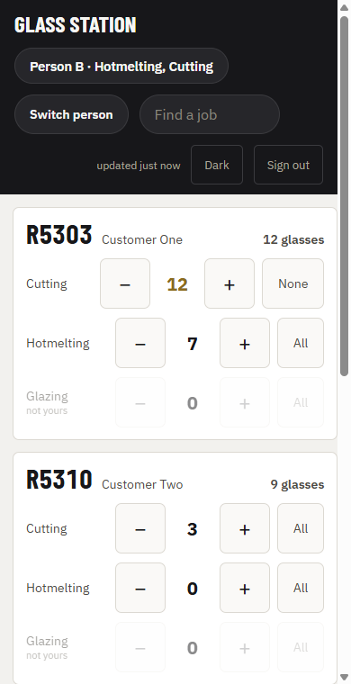
*The same board in light theme at phone width.*

### 4.8 Sign out

Signing out drops the shared station account's session entirely — normal
day-to-day use never needs this. It is only for the rare case where the
sign-in itself has expired (§6) and needs to be renewed.

### 4.9 What the tablet never shows or allows

The tablet never shows a customer's phone number, eircode, county, comments,
price, or any glass type (DG, TG, TUFF and the rest are the office's
business only — the floor sees one plain total). It cannot export anything,
cannot delete anything, cannot move a stage you do not personally hold, and
cannot reach the Master dashboard or any other station's data.

---

## 5. Daily routine

1. **Keep an office dashboard open somewhere.** The Master dashboard is the
   only thing that ever pushes jobs onto the floor's board — it does this
   every time it successfully loads the workbook. If nobody has the office
   dashboard open, the floor's board simply stops receiving new jobs and
   updates until someone opens it again.
2. **A new job reaching the floor.** As soon as a job with glass appears "in
   production" on the sheet and an office dashboard loads, it is pushed to
   the floor's list and appears as a card within a few minutes.
3. **A job already ticked off in the office.** If the office has already
   ticked some or all of a job's glass checkpoints before it reaches the
   floor, the tablet's card starts with those same numbers already counted —
   nobody on the floor has to re-tap what the office already recorded.
4. **When the office stops changing a job's floor numbers.** The moment
   anyone on the floor taps a job's card for the first time, the office
   dashboard never adjusts that job's counters again, no matter what changes
   afterwards in the office's own checkpoints — from that point on, only the
   floor's own taps move the numbers.
5. **Adding or changing a person or PIN.** This is a row in the `Station
   people` list, maintained by the admin in SharePoint — not something done
   from either dashboard page. The tablet picks up a new row, a stage
   change, or a PIN change within ten minutes on its own, or immediately on
   reload.
6. **Seeing who did what.** Use the Floor log window (§3.11) in the office,
   or the drawer's Glass station timeline for one job at a time.

---

## 6. Messages you may see and what to do

| Message (exact wording) | Where | Meaning / what to do |
|---|---|---|
| "This account has no access to the production workbook. Station accounts use the Glass station page." | Master dashboard | The signed-in account is the shared station account, not an office account. Follow the link to the Glass station page instead. |
| "Seeing the floor's progress needs a SharePoint permission that has not been granted yet. Nothing in the Excel file is involved." | Master dashboard | A tenant-wide SharePoint permission has not yet been granted. Ask the admin — see *Support and Maintenance* for the exact steps. Nothing is broken; nothing in Excel is affected. |
| "Ask the office to grant the SharePoint permission." | Tablet | The same missing permission, shown in the shorter wording the tablet uses since there is no admin sign-in on a shared device. |
| "The floor's SharePoint site is not there yet, or this account cannot see it. Ask the office." | Tablet | The `Floor stations` site (or the interim fallback) is not reachable yet. This is expected before the admin finishes setup. |
| "The 'Glass station' list is not in the floor's site yet. Ask the office to add it." / "The 'Station people' list is not in the floor's site yet. Ask the office to add it." | Tablet | One of the required lists has not been created yet in the site. |
| "cannot reach SharePoint — retrying" | Both | A read that had worked before has failed for now (network, rate limit). The dashboard keeps showing the last board it read and keeps retrying on its own; there is nothing to click. |
| "not saved yet — retrying" | Tablet | A tap you made has not yet reached SharePoint. It stays queued and retries on its own; nothing is lost, even across a reload. |
| "The sign-in has expired. Tap Sign out, then Sign in again." | Tablet | Tap **Sign out** in the header, then use the **Sign in again** button with the station account. Any taps not yet sent are kept and go out once signed in again. |
| "Nothing on the board yet." | Tablet | No jobs have been fed to the floor yet — usually because no office dashboard has loaded the workbook recently, or nothing on the floor is currently in production. |
| "A newer version of the dashboard is available  **Reload**" | Master dashboard | GitHub Pages can lag a deployment by up to about ten minutes. Click **Reload** whenever convenient — there is no urgency. |

---

## 7. Rules the dashboard enforces

- The `Production` sheet is only ever changed by a checkpoint colour or a
  whole-row section move — never a new row, a new sheet, or any other cell.
- No eircode ever leaves the app in an export, in any format, under any
  filter, on any template.
- No phone number leaves the app either, except on the **John print sheet**,
  which the owner asked for on 2026-09-09 and which is the only export that
  carries one. Its log line says so in words.
- Every export is logged once; nothing else about the exported data is kept.
- Print notes are kept by the dashboard in SharePoint and are never written
  into the Excel file — not into `Production (2)` either.
- The `Production (2)` sheet is only ever read, never written, by anything in
  the dashboard.
- Only the tablet ever writes the floor's own counters, By/At pairs, or log
  lines — the office never does, with the single exception of seeding a
  brand-new or never-tapped row from the office's own checkpoints.
- Once the floor has tapped a job for the first time, the office never
  changes that job's floor counters again.
- A person on the tablet can only move the glass stages they personally
  hold; every other stage is shown but disabled.
